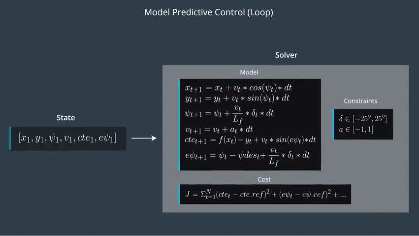
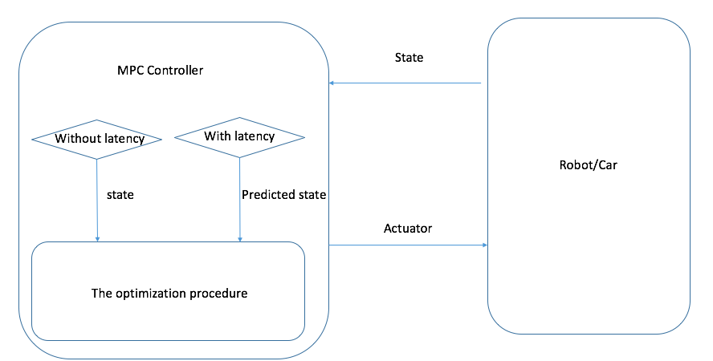

## Model Predictive Control

Here I will explain how I implemented the MPC model by list the answering the [rubric points](https://review.udacity.com/#!/rubrics/896/view)

### Code must compile without errors with cmake and make.
yes, the code can pass both command.

### Student describes their model in detail. This includes the state, actuators and update equations.

Below picture is the pipeline of the MPC model:


#### State

For the vehicle model introduced in the lecture, there are six states, which are: 
1. the position of the vehicle, represented by `px` and `py`;
2. the direction of the vehicle, represented by `psi`;
3. the velocity of the vehicle, represented by `v`;
4. the deviation from the central of the lane, represented by `cte`;
5. the error of the steer angel, represented by `epsi`.

The `px`, `py`, `psi` and `v` are from the simulator. 
The `cte` and `epsi` are calculated from fitted three degree polynomial. 

```
double cte = polyeval(coeffs, 0);  
double epsi = -atan(coeffs[1]); 
```

For calculation simplicity, I converted the Cartesian coordinates to the car's coordinate, which lead to the initial `px`, `py` and `psi` all zero, which leads to the following state initialization code:

```
Eigen::VectorXd state(6);
state << 0, 0, 0, v, cte, epsi;
```

#### The actuators (controls)

For the MPC model in the lecture, there are two actuators: 
1. the `steer_value`, which controls the steer angel of the car;
2. the `throttle_value`, which controls how fast the car drives;

They both are the output from the model. 
The idea behind the MPC model is to solve a constrained multi-variables optimization problem, the variables and their constraints are: 

| variables  | description  |  constraints |
| ---------  | -----------  |  ----------- |
| px  | the x position of the car  |  unlimited |
| py  | the y position of the car  |  unlimited |
| psi  | the steer angle of the car  |  unlimited |
| v  | the velocity of the car  |  unlimited |
| pte  | the deviation from the lane center  |  unlimited |
| epsi  | the delta of the steer angel  |  unlimited |
| steer_value  | the steer angel of the car  |  [-25,25] degree |
| throttle_value  | the acceleration of the car  |  [-1, 1] |

To solve the it, a cost function is defined, which takes into account of the errors of `cte`, `epsi` and `velocity`, and the objective is the minimize the sum of all this errors. 

#### The update equation

The MPC model uses the following update equations:
```
x_[t+1] = x[t] + v[t] * cos(psi[t]) * dt
y_[t+1] = y[t] + v[t] * sin(psi[t]) * dt
psi_[t+1] = psi[t] + v[t] / Lf * delta[t] * dt
v_[t+1] = v[t] + a[t] * dt
cte[t+1] = f(x[t]) - y[t] + v[t] * sin(epsi[t]) * dt
epsi[t+1] = psi[t] - psides[t] + v[t] * delta[t] / Lf * dt
```

The optimization procedure uses these update steps to calculate the corresponding variables, these variables are then used to minimize the objective iteratively. 


### Student discusses the reasoning behind the chosen N (timestep length) and dt (elapsed duration between timesteps) values. Additionally the student details the previous values tried.

The `N` (time steps) and `dt` (time duration) the parameters needs to be tuned. I tried the following values and get a working pair of `N=10` and `dt=0.1`

| N| dt| results|
| --------- | ---------- | -------- |
| 100 | 1 | the car can hardly drive, |
| 20 | 0.1 | the car drives the first half loop, with great osscilation, and then fails, with very large cost: Cost 1.88015e+06  |
| 3 | 0.1 | can not drive, the cost quickly grows to Cost 1.29856e+06 |
| 10 | 0.1 | the car drives, cost in scale of e+05|

<!--
~~The `N` (time steps) and `dt` (time duration) together determines the cars control span (the value of N*dt), if it's too large, the environment surrounding the car may change a lot, leads to unreliable decision; while if they are two small, a lot of computation required, which may not necessary. in the project, I choosed `N=10` and `dt=0.1`, every~~
-->


### A polynomial is fitted to waypoints. If the student preprocesses waypoints, the vehicle state, and/or actuators prior to the MPC procedure it is described.

I fitted the three degree polynomial. Before the fitting, the coordinates of the values are changed from Cartesian to the car coordinates, using the following equation:

```
void tranlateCoordinates(double px, 
                        double py, 
                        double psi,
                        std::vector<double> ptsx,
                        std::vector<double> ptsy,
                        std::vector<double>& waypoints_x,
                        std::vector<double>& waypoints_y) {
    for (int i = 0; i < ptsx.size(); i++) {
      double dx = ptsx[i] - px;
      double dy = ptsy[i] - py;
      waypoints_x.push_back(dx * cos(-psi) - dy * sin(-psi));
      waypoints_y.push_back(dx * sin(-psi) + dy * cos(-psi));
    }  
}
```


### The student implements Model Predictive Control that handles a 100 millisecond latency. Student provides details on how they deal with latency.

In reality, there is a latency between the controller sending and car receiving the commands, this latency may lead to unreliable decisions. To overcome this, the state sent to the solver should be predicted with latency time considered. I draw a simple picture to illustriate this: 



A thorough description of the prediction update can be found in [this discussion thread](https://discussions.udacity.com/t/how-to-incorporate-latency-into-the-model/257391/63).

I handled the latency with the following code in `main.cpp`

```
const double latency = 0.1;  // 100 ms
const double Lf = 2.67;
px = v * latency;
psi = - v * steer_angle / Lf * latency;
state << px, 0, psi, v, cte, epsi;

```


### The vehicle must successfully drive a lap around the track.

yes, the car can drive one loop, see the video in `./videos/driving.mov`

## Thoughts and future work
It has been three months since I started the term 2 in June; compared to term one, which requires a lot of parameter tunning, this one is much more logical from the mathematical perspective, but it doesn't mean the projects are easy to complete. The most challenging part is from the c++ programming, especially the MPC project, one difficulty is the manipulation of the libraries and the other is the debugging skills. So, to better complete this degree, I really need to improve my c++ programming skills. 


1. speed up the build processing;
2. how to define the cost factors, what's the relationship between the penalties and the manouviour? 
